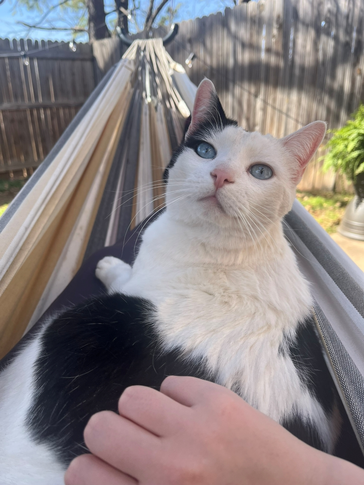
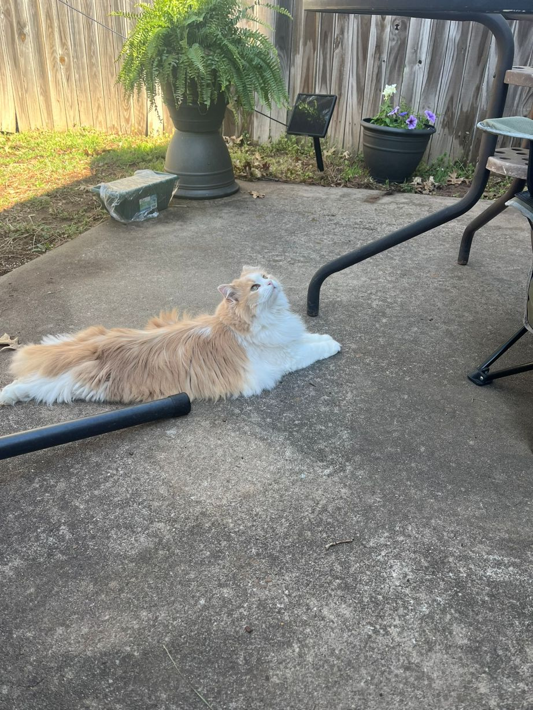

✨✨hi there✨✨ 

I'm Victoria, a Technical Communication student, barista, and real estate assistant. My only experience with coding is a tiny bit of HTML in high school, so this is all pretty much new to me!

I'm definitely a homebody and like to spend my downtime reading, playing video games, doing crosswords, and hanging out in the backyard with my plants and cats. 🌱🐈

<!--
**vamorrison73/vamorrison73** is a ✨ _special_ ✨ repository because its `README.md` (this file) appears on your GitHub profile.

Here are some ideas to get you started:

- 🔭 I’m currently working on ...
- 🌱 I’m currently learning ...
- 👯 I’m looking to collaborate on ...
- 🤔 I’m looking for help with ...
- 💬 Ask me about ...
- 📫 How to reach me: ...
- 😄 Pronouns: ...
- ⚡ Fun fact: ...
-->
